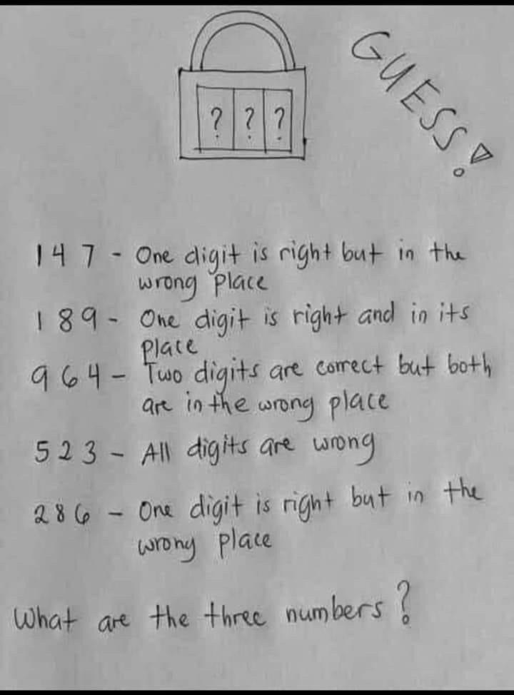
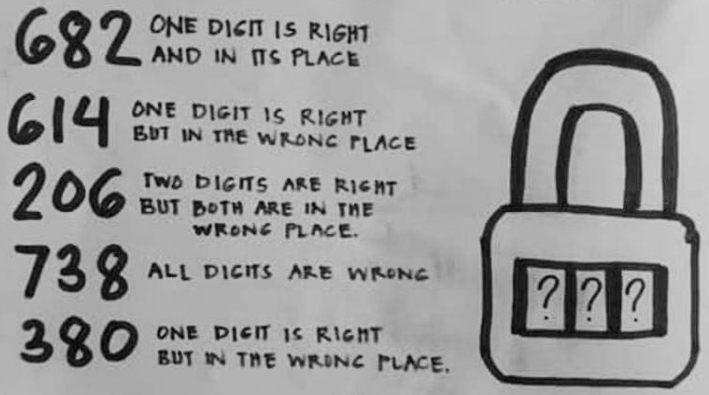

# Puzzle 1 - Count rows of a csv file

The [csv-sample.csv](./csv-sample.csv) has 1024 rows and you can verify this by opening it in Excel. If you open the file using a plain text editor such as notepad, you will notice that it has 1028 lines. 

Write a script with one of the following languages to count rows in a csv file. Your script must read [csv-sample.csv](./csv-sample.csv) and count csv rows to return a result of 1024.

* PowerShell
* Bash
* Python

You may also choose to write a console program in C# and .NET Core instead of writing a script.

### `What to submit`: All your source code in a single file (text or word)


# Puzzle 2 - Build a Docker Image

Create a (linux) docker image with Web API which returns your name and email address.

Sample docker image can be found at [seyongo/whoami](https://hub.docker.com/repository/docker/seyongo/whoami)

Try the sample.
```
docker pull seyongo/whoami:latest
docker run -it --rm -p 8080:80 --name sample seyongo/whoami:latest
```

Browse http://localhost:8080/api/email and see what it returns.

```json
{
    "displayName":"Se Yong Oh",
    "emailAddress":"seyong@seyong.net"
}
```

Create your own docker image which returns your name and email address, then publish it to Dockerhub.

***Note: If you’re concerned about privacy, you may choose to return a fake name and email address.***

### `What to submit`: A text file including the link to your own dockerhub image.


# Puzzle 3 - Padlock
## ***Please attempt this challenge and submit even if you only have a partial answer, we are keen to see your approach.***

Write a code in a programming language of your choice to solve the following puzzle.

***Sample Puzzle 1***




***Sample Puzzle 2***




### `What to submit`: A word file including your source code with explanation. See [example](Puzzle-Answer-Sample.md).

